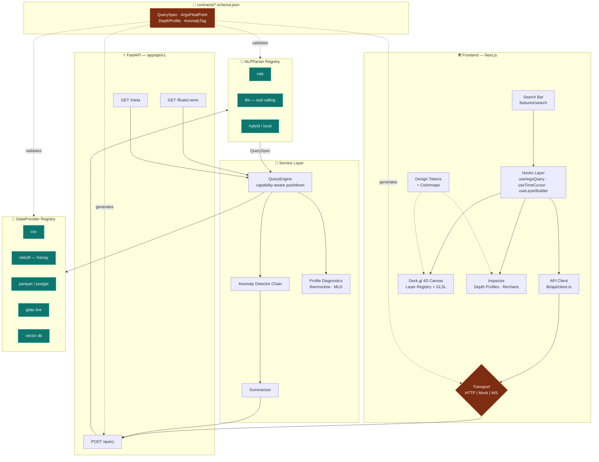
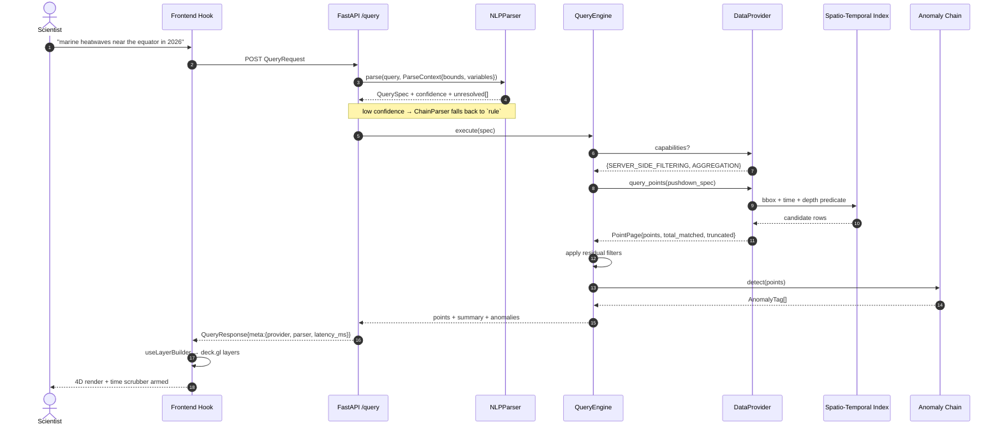
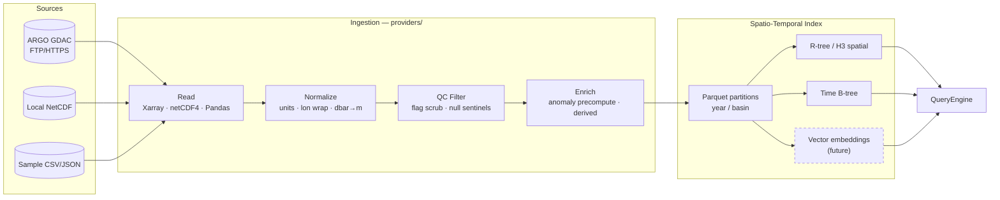

# FloatChat — Implementation Plan

> **Build status (2026-09-09).** This plan is the original blueprint and is kept as
> written. The system as **built** is documented in [`docs/architecture.md`](docs/architecture.md),
> and [`PROGRESS.md`](PROGRESS.md) tracks phase status. Three deliberate divergences,
> each with an ADR: the v0 provider reads **Parquet, not CSV** (ADR 0001 — the same data
> is 159 MB as CSV against 5.9 MB as Parquet); the **LLM parser was not built** (ADR 0002
> — no API key, and the rule parser was strengthened instead); and the theme is
> **dark only**. Where this document and `docs/architecture.md` disagree, the latter
> describes reality.

---


**Multi-Modal Semantic Query Engine & 4D Visualization for ARGO Oceanographic Data**

| | |
|---|---|
| **Document status** | Architectural blueprint — no application code written yet |
| **Audience** | Implementing engineers + future hand-off teams |
| **Governing principle** | Every volatile subsystem (data source, NLP engine, render backend, theme) sits behind a stable contract. Swapping an implementation must never require editing a consumer. |

---

## 0. Reading Guide & Design Philosophy

FloatChat is deliberately built as a **baseline that expects to be replaced piece by piece**. The realistic upgrade path is:

| Today (v0 baseline) | Tomorrow (team hand-off) |
|---|---|
| Local CSV / JSON sample floats | Live NetCDF from ARGO GDAC, Parquet lake, PostGIS |
| Rule-based regex intent parser | LLM tool-calling (Anthropic/OpenAI), then local Ollama |
| In-memory Pandas filtering | DuckDB / Parquet predicate pushdown, vector similarity search |
| Deck.gl `ScatterplotLayer` | Custom GLSL shaders, volumetric rendering, React Three Fiber |
| Static Tailwind theme | Tokenized multi-theme (light / dark / colorblind-safe / print) |

The plan below is ordered so that **the contracts are frozen first** (Phase 1–2), and only then are implementations filled in. This is what makes the swaps above additive rather than a refactor.

Three rules are enforced throughout, and every later section is an application of them:

1. **The schema is the API.** TypeScript interfaces and Pydantic models are generated from one source of truth and must stay byte-compatible in field names. A field rename is a breaking change and is versioned as such.
2. **No component knows where data came from.** React components receive props; hooks fetch; services call adapters; adapters touch I/O. Four layers, one direction.
3. **Registries, not `if/elif`.** Every pluggable thing is registered by string key and resolved at startup from config. Adding a provider means adding a file, never editing a switch statement.

---

## 1. Monorepo Architecture & Feature-Based Folder Structure

### 1.1 Top-level layout

```
Orion/
├── PROJECT_CONTEXT.md
├── IMPLEMENTATION_PLAN.md          # this document
├── README.md                       # quickstart, generated in Phase 1
├── Makefile                        # single entry point: make dev / test / lint / seed
├── docker-compose.yml              # backend + frontend + (future) postgis/qdrant
├── .env.example                    # every env var, documented, no secrets
│
├── contracts/                      # ⭐ SINGLE SOURCE OF TRUTH — language-neutral
│   ├── argo.schema.json            # JSON Schema for all domain entities
│   ├── query.schema.json           # QueryRequest / QueryResponse envelope
│   ├── CHANGELOG.md                # every schema change, with version bump
│   └── codegen/
│       ├── gen_typescript.py       # JSON Schema -> frontend/types/argo.ts
│       └── gen_pydantic.py         # JSON Schema -> backend/app/schemas/argo.py
│
├── backend/
│   ├── pyproject.toml
│   ├── app/
│   │   ├── main.py                 # FastAPI app factory ONLY — no logic
│   │   ├── config.py               # pydantic-settings; all switches live here
│   │   ├── container.py            # ⭐ dependency wiring / adapter resolution
│   │   ├── api/
│   │   │   ├── deps.py             # FastAPI Depends providers
│   │   │   └── v1/
│   │   │       ├── router.py       # aggregates the v1 routes
│   │   │       ├── query.py        # POST /api/v1/query
│   │   │       ├── floats.py       # GET  /api/v1/floats/{wmo_id}, /profiles
│   │   │       └── meta.py         # GET  /api/v1/meta  (bounds, variables, health)
│   │   ├── schemas/
│   │   │   ├── argo.py             # GENERATED — do not hand-edit
│   │   │   └── query.py            # GENERATED — do not hand-edit
│   │   ├── providers/              # ⭐ PLUGGABLE: where data comes from
│   │   │   ├── base.py             # DataProvider ABC
│   │   │   ├── registry.py         # name -> class registry + @register decorator
│   │   │   ├── csv_provider.py     # v0 default
│   │   │   ├── netcdf_provider.py  # Phase 5
│   │   │   └── gdac_provider.py    # Phase 8 stub (live ARGO GDAC)
│   │   ├── parsers/                # ⭐ PLUGGABLE: NL -> structured query
│   │   │   ├── base.py             # NLPParser ABC
│   │   │   ├── registry.py
│   │   │   ├── rule_parser.py      # v0 default, zero external deps
│   │   │   ├── llm_parser.py       # Anthropic/OpenAI tool-calling
│   │   │   └── prompts/            # versioned prompt templates + tool schemas
│   │   ├── services/
│   │   │   ├── query_engine.py     # applies a QuerySpec to a provider
│   │   │   ├── anomaly.py          # ⭐ PLUGGABLE detector registry
│   │   │   ├── profiles.py         # thermocline / halocline derivation
│   │   │   └── summarizer.py       # stats + natural-language answer text
│   │   ├── domain/
│   │   │   ├── models.py           # internal dataclasses (NOT wire schemas)
│   │   │   └── units.py            # unit conversion + canonical variable names
│   │   └── core/
│   │       ├── errors.py           # typed exceptions -> HTTP problem+json
│   │       ├── logging.py          # structured JSON logs, request ids
│   │       └── cache.py            # cache ABC: memory today, Redis later
│   ├── data/
│   │   ├── raw/                    # .gitignored, downloaded NetCDF
│   │   └── samples/                # committed small CSV/JSON fixtures
│   ├── scripts/
│   │   ├── seed_sample_data.py
│   │   └── fetch_gdac.py
│   └── tests/
│       ├── contract/               # ⭐ every provider/parser runs the SAME suite
│       ├── unit/
│       └── integration/
│
├── frontend/
│   ├── package.json
│   ├── tailwind.config.ts          # consumes design tokens, defines nothing itself
│   ├── app/                        # Next.js App Router
│   │   ├── layout.tsx
│   │   ├── page.tsx                # composition root — layout only, no logic
│   │   └── api/                    # BFF proxy routes (hides backend URL/keys)
│   ├── features/                   # ⭐ FEATURE-FIRST, not type-first
│   │   ├── search/
│   │   │   ├── components/         # SearchBar, QueryChips, ExampleQueries
│   │   │   ├── hooks/              # useArgoQuery
│   │   │   └── index.ts            # public surface of the feature
│   │   ├── map/
│   │   │   ├── components/         # MapCanvas, MapControls, DepthAxis, Legend
│   │   │   ├── layers/             # ⭐ PLUGGABLE deck.gl layer factories
│   │   │   ├── shaders/            # ⭐ GLSL, isolated from React
│   │   │   └── hooks/              # useViewState, useLayerBuilder
│   │   ├── timeline/
│   │   │   ├── components/         # TimeScrubber, PlaybackControls
│   │   │   └── hooks/              # useTimeCursor, usePlayback
│   │   ├── inspector/
│   │   │   ├── components/         # FloatInspector, DepthProfileChart, StatCards
│   │   │   └── hooks/              # useFloatDetails, useDepthProfile
│   │   └── anomalies/
│   │       ├── components/         # AnomalyBadge, AnomalyList
│   │       └── hooks/              # useAnomalies
│   ├── lib/
│   │   ├── api/
│   │   │   ├── client.ts           # ⭐ ONLY file that calls fetch()
│   │   │   ├── endpoints.ts        # typed endpoint definitions
│   │   │   └── transport.ts        # Transport interface: HTTP | mock | websocket
│   │   ├── hooks/                  # cross-feature hooks only
│   │   ├── state/                  # Zustand stores (selection, view, time)
│   │   └── utils/                  # color scales, geo math, formatters
│   ├── types/
│   │   └── argo.ts                 # GENERATED — do not hand-edit
│   ├── design/                     # ⭐ THEME LAYER
│   │   ├── tokens.ts               # colors, spacing, type scale, z-index
│   │   ├── scales.ts               # temperature/salinity -> RGB colormaps
│   │   └── themes/                 # dark.ts, light.ts, colorblind-safe.ts
│   └── components/ui/              # primitive, domain-free (Button, Panel, Slider)
│
└── docs/
    ├── architecture.md             # rendered Mermaid diagrams
    ├── adr/                        # Architecture Decision Records, numbered
    └── extension-guide.md          # ⭐ "how to add X" cookbook for new teammates
```

### 1.2 Structural rules (enforced by lint, not by convention)

| Rule | Enforcement |
|---|---|
| A feature may not import from another feature's internals | ESLint `no-restricted-imports` — only `features/*/index.ts` is importable cross-feature |
| No React component may call `fetch` | ESLint rule restricting `fetch`/`axios` outside `lib/api/` |
| No hardcoded hex colors in components | Stylelint + ESLint rule; colors must come from `design/tokens.ts` |
| API routes may not import providers directly | Python import-linter contract: `api` → `services` → `providers`, never skipping or reversing |
| Generated files are never hand-edited | CI regenerates from `contracts/` and fails on diff |

### 1.3 Build phases

| Phase | Deliverable | Gate to pass before proceeding |
|---|---|---|
| **P1** | Contracts frozen: JSON Schema + both codegen targets run green | `make contracts` produces zero diff on rerun |
| **P2** | Backend skeleton: FastAPI boots, `/meta` + `/query` return schema-valid stubs | Contract tests pass against a `NullProvider` |
| **P3** | CSV provider + rule parser + query engine | Contract test suite passes for `csv` provider |
| **P4** | Frontend shell: layout, API client, mock transport, typed hooks | Frontend renders full UI against mock transport with backend off |
| **P5** | NetCDF provider + real sample ARGO data | Same contract suite passes for `netcdf` provider, no API change |
| **P6** | Deck.gl 3D map + time scrubbing | 60fps at 50k points; time cursor drives layers |
| **P7** | Inspector: depth profiles, thermocline detection, Recharts panels | Click float → profile renders |
| **P8** | LLM parser behind the same `NLPParser` interface | Same contract suite passes for `llm` parser; `rule` remains fallback |
| **P9** | Anomaly detectors, summarizer, polish, docs, ADRs | Full e2e; `docs/extension-guide.md` complete |

Each phase is independently demoable. If the project is halted at any phase boundary, what exists is coherent and running.

---

## 2. Strict Data Schema Contracts

### 2.1 Source of truth and generation flow

```
contracts/argo.schema.json
        │
        ├── gen_typescript.py ──> frontend/types/argo.ts   (interfaces + type guards)
        └── gen_pydantic.py   ──> backend/app/schemas/argo.py (BaseModel + validators)
```

`make contracts` regenerates both. CI runs it and fails if `git diff` is non-empty. This is the mechanism that makes "strictly typed API contract" a *checked* property rather than a hope.

**Wire conventions frozen in v1:**

- Field names: `snake_case` on the wire, in both languages. No camelCase translation layer — translation layers are where contracts rot.
- Timestamps: ISO-8601 UTC with `Z` suffix, always.
- Coordinates: longitude in `[-180, 180]`, latitude in `[-90, 90]`. Normalization happens **in the provider**, never downstream.
- Depth: reported as **positive metres downward** (`depth_m`), converted from ARGO pressure (dbar) inside the provider. `pressure_dbar` is retained alongside for scientific fidelity.
- Missing values: `null`, never `-999`, `NaN`, or `9999`. Sentinel scrubbing is a provider responsibility.
- Every envelope carries `schema_version`.

### 2.2 Core entities

#### `ArgoFloatPoint` — the atomic 4D measurement

The one type the entire system revolves around: a single measurement at a single depth, at a single time, from a single float.

| Field | Type | Notes |
|---|---|---|
| `point_id` | `string` | Stable synthetic id: `{wmo_id}:{cycle}:{level}` |
| `wmo_id` | `string` | WMO float identifier (string, not int — leading zeros matter) |
| `cycle_number` | `int` | Profile cycle index |
| `latitude` | `float` | −90..90 |
| `longitude` | `float` | −180..180 |
| `depth_m` | `float` | Positive down |
| `pressure_dbar` | `float \| null` | Original ARGO measurement |
| `timestamp` | `string` | ISO-8601 UTC |
| `temperature_c` | `float \| null` | Sea water temperature |
| `salinity_psu` | `float \| null` | Practical salinity |
| `qc_flag` | `QCFlag` | ARGO QC code, normalized |
| `anomaly_tags` | `AnomalyTag[]` | Empty array, never null |
| `extras` | `Record<string, number \| null>` | ⭐ **Extension slot** — BGC variables (oxygen, chlorophyll, nitrate, pH) land here with zero schema change |

The `extras` bag is the single most important extensibility decision in the schema. It lets a future team ingest biogeochemical ARGO variables and surface them in the UI (driven by `/meta`'s variable descriptor list) without a contract version bump.

#### Supporting entities

| Entity | Purpose | Key fields |
|---|---|---|
| `FloatTrajectory` | One float's path over time | `wmo_id`, `points: ArgoFloatPoint[]` (surface-only, time-ordered), `start_time`, `end_time`, `bbox` |
| `DepthProfile` | One cast: measurements vs. depth | `wmo_id`, `cycle_number`, `timestamp`, `levels: ProfileLevel[]`, `derived: ProfileDerived` |
| `ProfileLevel` | One depth bin in a cast | `depth_m`, `temperature_c`, `salinity_psu`, `qc_flag`, `extras` |
| `ProfileDerived` | Computed diagnostics | `thermocline_depth_m`, `halocline_depth_m`, `mixed_layer_depth_m`, `max_gradient_c_per_m`, `method` (names the algorithm used) |
| `AnomalyTag` | A flagged condition | `code` (e.g. `SURFACE_HEATWAVE`), `severity` (`info`\|`warning`\|`critical`), `label`, `detected_by` (detector id), `evidence: Record<string, number>` |
| `VariableDescriptor` | Runtime variable metadata | `key`, `display_name`, `unit`, `min`, `max`, `colormap`, `is_extra` — ⭐ lets the UI render controls for variables it was never coded against |

#### Query envelope

**`QueryRequest`** — `{ query: string, filters?: QuerySpec, options?: { limit, include_profiles, parser } }`

The optional `parser` field lets a client force a specific parser implementation — invaluable for A/B evaluation of a new LLM parser against the rule baseline in production.

**`QuerySpec`** — the structured intermediate representation, and the true contract boundary between NLP and data:

| Field | Type |
|---|---|
| `bbox` | `{ min_lat, max_lat, min_lon, max_lon } \| null` |
| `depth_range_m` | `{ min, max } \| null` |
| `time_range` | `{ start, end } \| null` |
| `variable_filters` | `VariableFilter[]` — `{ variable, op: gt\|gte\|lt\|lte\|between, value, value2? }` |
| `wmo_ids` | `string[] \| null` |
| `anomaly_codes` | `string[] \| null` |
| `aggregation` | `none \| by_float \| by_time_bucket \| by_depth_bin` |
| `limit` | `int` |

`QuerySpec` is deliberately **declarative and engine-agnostic**. A rule parser, an LLM, or a future SQL-generating agent all emit the same structure; a Pandas engine, a DuckDB engine, or a PostGIS engine all consume it. This one type is what decouples §3's two adapter families from each other.

**`QueryResponse`** — `{ schema_version, spec, points, trajectories?, profiles?, summary, anomalies, meta }`

`meta` carries `{ provider, parser, latency_ms, total_matched, truncated, warnings[] }`. Surfacing provider/parser identity in the response is what makes swapping them observable in the UI and in logs rather than invisible.

### 2.3 Validation strategy

- **Pydantic v2** models with field validators for range checks, `model_config = ConfigDict(extra="forbid")` on requests (catch typos) and `extra="allow"` on responses (forward compatibility).
- **TypeScript**: generated `interface` + a generated runtime type guard per entity. The API client validates in development, trusts in production.
- **Contract tests** (`backend/tests/contract/`) assert every provider returns objects that validate against the JSON Schema. This suite is the gate every new adapter must pass — it is the reason a swap is safe.

---

## 3. Pluggable Backend Adapter Architecture

Two adapter families, identical mechanics: an ABC, a registry, config-driven resolution, and a shared contract test suite.

### 3.1 The `DataProvider` interface

```
providers/base.py
```

| Method | Signature (conceptual) | Contract |
|---|---|---|
| `initialize()` | `async () -> None` | Load/connect. Called once at startup. Must be idempotent. |
| `query_points(spec)` | `async (QuerySpec) -> PointPage` | Return points matching spec. **Must honour `limit` and report `total_matched` and `truncated`.** |
| `get_trajectory(wmo_id, time_range)` | `async (...) -> FloatTrajectory \| None` | Time-ordered surface positions |
| `get_profile(wmo_id, cycle)` | `async (...) -> DepthProfile \| None` | One cast, depth-ordered ascending |
| `list_floats(bbox, time_range)` | `async (...) -> FloatSummary[]` | Lightweight index for pickers |
| `describe()` | `() -> ProviderMetadata` | Spatial/temporal bounds, available `VariableDescriptor[]`, record count, capability flags |
| `health()` | `async () -> HealthStatus` | Readiness probe |
| `close()` | `async () -> None` | Release handles/connections |

**Capability negotiation.** `ProviderMetadata.capabilities` is a set of flags: `SERVER_SIDE_FILTERING`, `AGGREGATION`, `VECTOR_SEARCH`, `STREAMING`, `LIVE_UPDATES`. The `QueryEngine` reads these and degrades gracefully — pushing a filter down to a provider that supports it, or applying it in-process when the provider does not. This is the mechanism that lets a naive CSV provider and a PostGIS provider coexist behind one interface without the CSV provider having to fake SQL.

**Registration.** Each module ends with `@register_provider("csv")`. `container.py` resolves `settings.DATA_PROVIDER` against the registry at startup. Adding a provider = drop in a file + set one env var. No consumer edits, ever.

**Planned implementations:**

| Key | Phase | Backing store | Capabilities |
|---|---|---|---|
| `csv` | P3 | Pandas over committed CSV/JSON samples | in-process filtering |
| `netcdf` | P5 | Xarray + netCDF4, lazy-loaded, Parquet-cached | in-process filtering, aggregation |
| `parquet` | future | DuckDB predicate pushdown | server-side filtering, aggregation, streaming |
| `gdac` | P8 stub | Live ARGO GDAC fetch + local cache | live updates |
| `postgis` | future | PostgreSQL + PostGIS + TimescaleDB | full pushdown |
| `vector` | future | Qdrant/pgvector for semantic float similarity | vector search |
| `null` | P2 | Empty, deterministic | none — used for wiring tests |

A **`CachingProvider` decorator** wraps any provider with the `Cache` ABC (in-memory now, Redis later). Because it implements `DataProvider` itself, caching composes without any provider knowing it exists.

### 3.2 The `NLPParser` interface

```
parsers/base.py
```

| Method | Contract |
|---|---|
| `parse(query: str, context: ParseContext) -> ParseResult` | Returns `{ spec: QuerySpec, confidence: float, rationale: str, unresolved: string[] }` |
| `describe() -> ParserMetadata` | `{ id, requires_network, model?, cost_tier, supports_followup }` |

`ParseContext` carries the provider's `describe()` output — available variables, data bounds, valid date range. **The parser is told what data actually exists**, so an LLM cannot hallucinate a variable the provider does not have, and a query outside the dataset's time range is caught at parse time with a useful message rather than returning zero rows.

`unresolved` is a first-class output: the list of query phrases the parser could not map. The UI renders these as clarification chips ("I ignored: *'last summer'* — pick a date range?"). This turns parser limitations into visible product behaviour instead of silent wrong answers.

**Planned implementations:**

| Key | Phase | Approach |
|---|---|---|
| `rule` | P3 | Regex + gazetteer (named ocean regions, "equator", "North Atlantic"), date phrase parsing, threshold keywords ("heatwave", "warmer than 29"). Zero network, zero cost, deterministic — the permanent fallback. |
| `llm` | P8 | Anthropic/OpenAI **tool calling** with `QuerySpec` as the tool's JSON Schema — the model fills the schema, so the output is structurally valid by construction. Prompts versioned in `parsers/prompts/`. |
| `hybrid` | P9 | Rule parser first; escalate to LLM only when `confidence < threshold`. Cuts cost and latency dramatically on common queries. |
| `local` | future | Ollama / llama.cpp behind the identical interface |

**Resilience.** `ChainParser` composes parsers with fallback: try `llm`, on timeout/error/low-confidence fall back to `rule`. The API never 500s because an LLM vendor is down. `QueryResponse.meta.parser` reports which one actually answered.

### 3.3 The `QueryEngine` — the seam between the two families

`query_engine.py` is intentionally the only place that knows about both. It:

1. Takes a `QuerySpec` (from any parser).
2. Reads provider capabilities.
3. Splits the spec into a *pushdown* portion and a *residual* portion.
4. Calls `provider.query_points(pushdown_spec)`.
5. Applies residual filters in-process.
6. Runs the anomaly detector chain.
7. Hands results to `summarizer.py`.

Because both inputs are interfaces, `QueryEngine` never changes when either side is swapped. This is the load-bearing design decision of the backend.

### 3.4 Anomaly detectors — a third registry

`AnomalyDetector` ABC: `detect(points, context) -> AnomalyTag[]`, plus `describe()`.

| Key | Phase | Logic |
|---|---|---|
| `surface_heatwave` | P9 | `depth_m < 10 and temperature_c > threshold` (threshold configurable, default 29 °C) |
| `salinity_outlier` | P9 | Z-score vs. regional climatology baseline |
| `thermocline_shift` | future | Compare derived thermocline depth against seasonal norm |
| `ml_detector` | future | Trained model behind the identical interface |

Detectors are **config-listed** (`ANOMALY_DETECTORS=surface_heatwave,salinity_outlier`), so enabling a new detector is a config change. Each tag records `detected_by` and machine-readable `evidence`, so the UI can explain *why* a point was flagged without any detector-specific frontend code.

---

## 4. Modular Frontend Component Hierarchy & React Hooks Layer

### 4.1 The four-layer discipline

```
┌───────────────────────────────────────────────────┐
│ L4  Components   props in, JSX out. No fetch,     │
│                  no business logic, no colors.    │
├───────────────────────────────────────────────────┤
│ L3  Hooks        useArgoQuery, useFloatDetails,   │
│                  useDepthProfile, useTimeCursor   │
├───────────────────────────────────────────────────┤
│ L2  API Services lib/api/client.ts + endpoints    │
├───────────────────────────────────────────────────┤
│ L1  Transport    HTTP | Mock | (future) WebSocket │
└───────────────────────────────────────────────────┘
```

The `Transport` interface at L1 is what lets the entire frontend be developed, demoed, and tested with the backend switched off (`NEXT_PUBLIC_TRANSPORT=mock`). It is also the seam where a future team adds streaming/live float updates without touching a single component.

### 4.2 Component hierarchy

```
app/page.tsx  (composition root — layout only)
│
├── <AppShell>                                    components/ui
│   ├── <TopBar>
│   │   └── features/search
│   │       ├── <SearchBar>         ← useArgoQuery()
│   │       ├── <ExampleQueries>
│   │       └── <ParsedSpecChips>   ← renders QuerySpec + unresolved[]
│   │
│   ├── <MainStage>
│   │   ├── features/map
│   │   │   ├── <MapCanvas>         ← useLayerBuilder(), useViewState()
│   │   │   │   └── layers/         ← ⭐ layer factory registry
│   │   │   ├── <MapControls>       pitch / depth-exaggeration / basemap
│   │   │   ├── <DepthAxis>
│   │   │   └── <ColorLegend>       ← driven by VariableDescriptor
│   │   │
│   │   └── features/timeline
│   │       ├── <TimeScrubber>      ← useTimeCursor()
│   │       └── <PlaybackControls>  ← usePlayback()
│   │
│   └── <SidePanel>
│       ├── features/inspector
│       │   ├── <FloatInspector>    ← useFloatDetails(wmoId)
│       │   ├── <DepthProfileChart> ← useDepthProfile()  [Recharts]
│       │   ├── <ThermoclineMarker>
│       │   └── <SummaryStats>
│       └── features/anomalies
│           ├── <AnomalyList>       ← useAnomalies()
│           └── <AnomalyBadge>
```

### 4.3 The hooks layer — full specification

| Hook | Returns | Responsibility |
|---|---|---|
| `useArgoQuery()` | `{ submit, data, spec, isLoading, error, unresolved }` | Owns the NL query lifecycle. Debounce, abort previous in-flight request, cache by query string. **The only path from user text to backend.** |
| `useFloatDetails(wmoId)` | `{ trajectory, summary, isLoading }` | Fetch on selection change; `null` id = no fetch |
| `useDepthProfile(wmoId, cycle)` | `{ profile, derived, isLoading }` | Cast data + thermocline diagnostics |
| `useAnomalies(filter?)` | `{ anomalies, byCode, counts }` | Derives grouped views from current response |
| `useTimeCursor()` | `{ cursor, range, setCursor, windowMs }` | Global 4th-dimension state (Zustand) |
| `usePlayback()` | `{ isPlaying, speed, play, pause, step }` | `requestAnimationFrame` loop driving `useTimeCursor` |
| `useSelection()` | `{ selectedFloat, hoveredPoint, select, hover }` | Cross-feature selection state |
| `useViewState()` | `{ viewState, setViewState, flyTo, resetView }` | Camera; persists to URL query params for shareable links |
| `useLayerBuilder()` | `deck.gl Layer[]` | ⭐ Composes registered layer factories from current data + time cursor + theme. **The single point where visualization is assembled.** |
| `useColorScale(variable)` | `(value) => [r,g,b,a]` | Reads colormap from `design/scales.ts` keyed by `VariableDescriptor.colormap` |
| `useMeta()` | `{ variables, bounds, provider, parser }` | Fetches `/meta` once; ⭐ **drives dynamic UI** — variable dropdowns are generated from this, so new backend variables appear with no frontend change |

**Discipline:** every hook returns a plain object, holds no JSX, and is independently unit-testable with a mock transport. Components stay dumb enough to be restyled or replaced wholesale.

### 4.4 Visualization extension points

**Layer registry** (`features/map/layers/`). Each file exports a `LayerFactory`:

```
type LayerFactory = {
  id: string
  label: string
  supports: (meta: MetaResponse) => boolean
  build: (ctx: LayerContext) => Layer | Layer[]
}
```

`LayerContext` = `{ points, trajectories, timeCursor, colorScale, theme, selection }`. Planned factories: `pointCloud3d`, `trajectoryPaths`, `depthColumns`, `anomalyHalos`, `heatmapSurface`. `useLayerBuilder` iterates the registry and builds whatever is registered and enabled.

**Adding a new visualization = adding one file to the registry.** No edits to `MapCanvas`, no edits to hooks. This is the "upgrade UI shaders" requirement made concrete.

**Shader isolation** (`features/map/shaders/`). Custom GLSL lives in standalone `.glsl.ts` modules consumed by layer factories via deck.gl's `getShaders()` / `inject` hooks. Because React never touches shader source, a team can replace point sprites with volumetric ray-marching or add a custom depth-fog pass by editing files no component imports.

**Render-backend seam.** `MapCanvas` renders a `<DeckGL>` today, but its props are the deck-agnostic `LayerContext`. A future React Three Fiber or Cesium implementation drops in as a sibling `MapCanvas.r3f.tsx` selected by config — hooks, state, and the rest of the UI are untouched.

### 4.5 Theme & design token layer

`design/tokens.ts` is the sole origin of every visual constant: palette, semantic colors (`surface`, `accent`, `anomaly.critical`), spacing scale, type scale, radii, z-index ladder, motion durations. `tailwind.config.ts` **imports** these — it defines nothing itself, so Tailwind classes and runtime WebGL colors are guaranteed to come from the same source (critical, since deck.gl needs numeric RGB arrays that CSS variables cannot supply).

`design/scales.ts` holds scientific colormaps (`thermal`, `haline`, `viridis`, `diverging_balance`) as data. A `VariableDescriptor.colormap` string from the backend selects one at runtime.

`design/themes/` provides full token sets: `dark` (default), `light`, `colorblind-safe`, `presentation`. Swapping themes is a provider value change — **zero component edits**, which is the stated goal.

### 4.6 State management

Zustand, one store per concern, no global god-object:

| Store | Holds |
|---|---|
| `useQueryStore` | last query, spec, response, history |
| `useTimeStore` | cursor, range, playback |
| `useSelectionStore` | selected float, hovered point |
| `useViewStore` | camera, active layers, depth exaggeration |
| `useThemeStore` | active theme key |

Server state is cached by the hooks layer (React Query optional in P4 — the `Transport` seam makes adding it non-breaking).

---

## 5. System Architecture Diagram Spec (Mermaid.js)

These render in `docs/architecture.md`. Three diagrams, each answering a different question.

### 5.1 Component & data-flow architecture



### 5.2 Low-latency spatio-temporal retrieval path



### 5.3 Ingestion & indexing lifecycle



---

## 6. Future Extension Points for Team Hand-off

Each entry is written as an executable recipe. `docs/extension-guide.md` will carry these verbatim.

### EP-1 — Swap CSV/JSON for live NetCDF or a Vector DB

1. Create `backend/app/providers/<name>_provider.py`.
2. Subclass `DataProvider`; implement all eight methods.
3. Declare honest `capabilities` in `describe()` — the `QueryEngine` compensates for what you lack; lying is the only way to break this.
4. Decorate with `@register_provider("<name>")`.
5. Run `pytest tests/contract -k <name>` — the **same** suite every provider passes.
6. Set `DATA_PROVIDER=<name>`.

**Files touched: 1 new + 1 env var. Zero changes to API routes, services, or any frontend file.**

### EP-2 — Swap the NLP engine

1. Create `backend/app/parsers/<name>_parser.py`, subclass `NLPParser`.
2. Emit a valid `QuerySpec` — for LLMs, pass `QuerySpec`'s JSON Schema as the tool definition so the output is structurally valid by construction.
3. `@register_parser("<name>")`; set `NLP_PARSER=<name>`.
4. Keep `rule` in `PARSER_FALLBACK_CHAIN` so vendor outages degrade instead of failing.
5. Evaluate against the golden query set in `tests/contract/test_parsers.py` (query → expected `QuerySpec`) before promoting.

**Files touched: 1 new + config.** The `parser` override field on `QueryRequest` allows side-by-side comparison in production.

### EP-3 — Upgrade UI shaders / visualization

1. Add `features/map/shaders/<effect>.glsl.ts`.
2. Add `features/map/layers/<name>Layer.ts` exporting a `LayerFactory`.
3. Register it. `useLayerBuilder` picks it up automatically; `supports(meta)` gates it on data availability.

**Files touched: 2 new.** `MapCanvas`, hooks, and state are untouched. Replacing deck.gl entirely means one new `MapCanvas.<backend>.tsx` behind the same `LayerContext` props.

### EP-4 — Re-theme the entire UI

Edit `design/tokens.ts` or add `design/themes/<name>.ts`. Because Tailwind config and WebGL colormaps both read from the same module, one edit restyles both DOM and canvas. **Zero component files touched** — the stated requirement, structurally guaranteed.

### EP-5 — Add a new scientific variable (e.g. dissolved oxygen)

1. Provider populates `extras["oxygen_umol_kg"]` and adds a `VariableDescriptor` to `describe()`.
2. Done. `useMeta()` surfaces it; variable dropdowns, color legend, and profile chart axes are all generated from descriptors.

**No schema version bump, no frontend change.** This is what the `extras` bag and `VariableDescriptor` exist for.

### EP-6 — Add an anomaly detector

Subclass `AnomalyDetector`, `@register_detector("<code>")`, add to `ANOMALY_DETECTORS`. Emit `evidence` so the UI can explain the flag generically.

### EP-7 — Scale out

The seams are already cut: `Cache` ABC → Redis; `Transport` → WebSocket for live float streaming; provider `STREAMING` capability → chunked/Arrow responses; `parquet`/`postgis` providers → out-of-memory datasets. Each is an implementation behind an existing interface.

### EP-8 — Version the API

`/api/v1` is namespaced from day one. A v2 adds `schemas/v2/` and `api/v2/` while v1 keeps serving. `contracts/CHANGELOG.md` records every field change with its version.

### Hand-off checklist (definition of done for the foundation)

- [ ] `contracts/` regenerates both languages with zero diff
- [ ] Contract test suite green for **every** registered provider and parser
- [ ] `docs/extension-guide.md` contains EP-1…EP-8 with runnable steps
- [ ] `docs/adr/` records: why adapters, why `QuerySpec` as the IR, why JSON Schema codegen, why Zustand, why deck.gl
- [ ] `.env.example` documents every switch (`DATA_PROVIDER`, `NLP_PARSER`, `ANOMALY_DETECTORS`, `NEXT_PUBLIC_TRANSPORT`, `THEME`)
- [ ] Import-linter and ESLint boundary rules wired into CI — the layering is *enforced*, not merely documented
- [ ] Frontend renders the full UI with `NEXT_PUBLIC_TRANSPORT=mock` and the backend stopped

---

## 7. Risks & Mitigations

| Risk | Mitigation |
|---|---|
| Schema drift between TS and Python | Codegen from one JSON Schema; CI fails on diff |
| Abstraction overhead slows v0 delivery | Registries are ~30 lines each; `csv` + `rule` are deliberately trivial so P3 lands fast |
| Provider capability lies cause silent wrong results | Contract suite asserts declared capabilities actually work |
| WebGL perf collapse at high point counts | Budget checkpoint at P6: 50k points @ 60fps; binary attribute paths and aggregation layers are the escape hatches |
| LLM latency/cost on every query | `hybrid` parser escalates only on low rule-parser confidence |
| NetCDF variable naming varies across GDAC files | Normalization confined to `domain/units.py`, with a variable-alias map |

---

*End of plan. No application code has been written. Phase P1 (freeze `contracts/`) is the recommended next action.*
