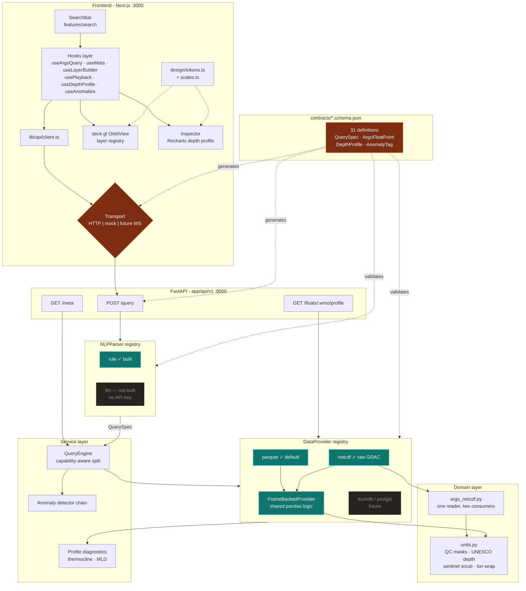
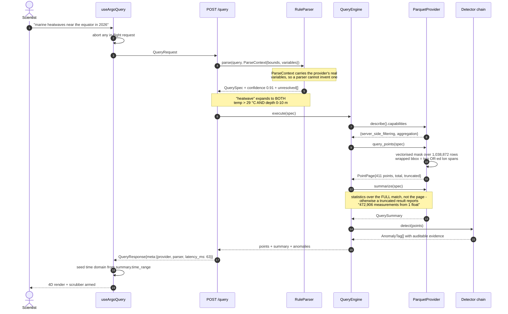
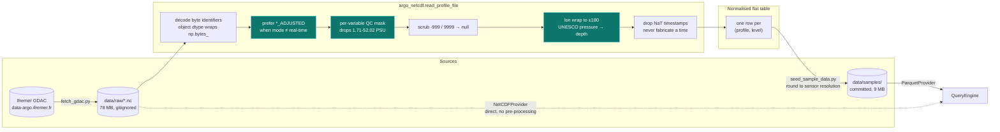
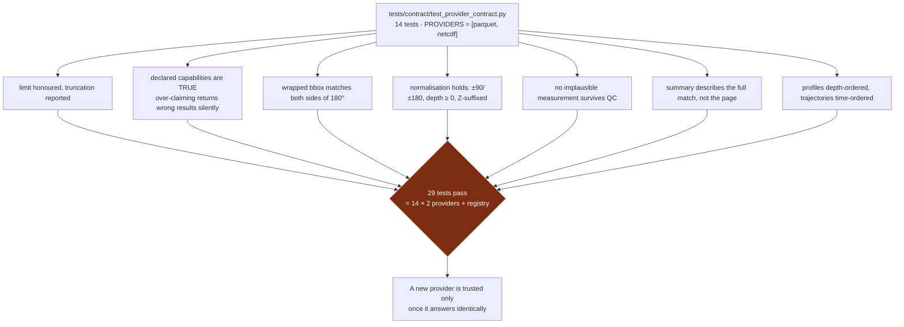

# FloatChat Architecture

Diagrams of the **system as built**, not as planned. Where the implementation diverged
from `IMPLEMENTATION_PLAN.md`, these reflect reality and the ADRs record why.

---

## 1. Component and data flow

Pluggable nodes are teal; generated contract artefacts are amber.

## 2. Low-latency spatio-temporal retrieval

The measured path for the headline query. Latencies are real, from the running system.

## 3. Ingestion and normalisation

Every step here exists because a real GDAC file broke something without it.

## 4. Why swapping a provider is safe

---

## Measured characteristics

| | |
|---|---|
| Fixture | 1,038,872 measurements · 12 floats · 1,567 profiles · 5.9 MB |
| Query latency | 63 ms (surface heatwave, 411 results) to 311 ms (472k-row deep scan) |
| Startup | Parquet ~0.4 s · NetCDF ~1 s per float |
| Frontend smoke test | 15/15 (`npm run verify`) — WebGL paints, query round-trips, picking works |
| Frame rate | **not verified** — software rasteriser only, ADR 0003 |
| Backend tests | 78 green |
| Contract definitions | 31, generation verified idempotent |

## Divergences from the plan

| Planned | Built | Why |
|---|---|---|
| `csv` provider | `parquet` | 159 MB vs 5.9 MB — see ADR 0001 |
| `llm` parser (P8) | not built | No API key; decided with the user. The rule parser is the permanent fallback, not a placeholder. |
| Dark + light + colorblind themes | dark only | Decided with the user; one ground fully resolved beats three partial ones |
| Per-provider duplicate logic | `FrameBackedProvider` | Two providers sharing query logic cannot drift apart |
